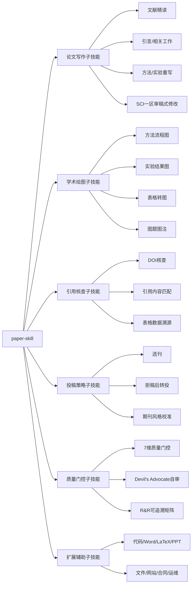
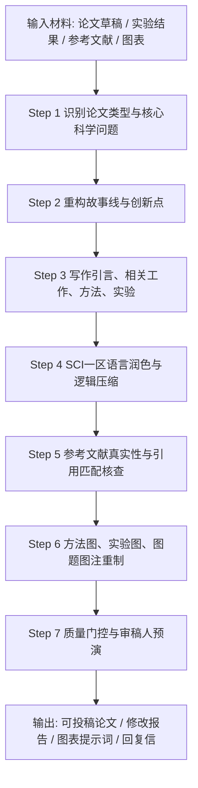

# paper-skill

> 🎓 专为中文学者设计的学术写作 AI 工具库 | Academic Paper Skill for Chinese Researchers

**你是否面临这些困境？**
- 中文写完不知道怎么转成地道英文？
- 投稿信（Cover Letter）不知道从何下手？
- 审稿意见看懂了，用英文回复却词不达意？
- 润色完了担心有 AI 痕迹被编辑识别？

**paper-skill 专门为此设计**：22 个场景覆盖从读文献到投稿全流程，**中英双语提示词**，直接用中文和 AI 对话即可，无需翻译。

核心优势不是“提示词多”，而是把论文写作拆成可复用的学术工作流：**读文献 → 搭故事线 → 写论文 → 改语言 → 查引用 → 画图表 → 审稿预演 → 投稿回复**。

**主力平台：[Claude Code](https://claude.ai/code) · [OpenAI Codex CLI](https://github.com/openai/codex)**  
另支持 Qwen Code / Kimi Code / DeepSeek / Comate / 通义灵码 / OpenClaw 等 6 个平台。

---

## 🧠 paper-skill 子技能架构



## 🧩 论文写作工作流



## 🎨 学术绘图工作流


---

## 🇨🇳 中文学者快速导航

| 你的场景 | 用哪个提示词 |
|---------|------------|
| 中文稿件 → 地道英文论文 | [§22 中文母语者专项](#22-中文母语者写英文期刊专项) → 中译英全文 |
| 重写论文故事线/创新点 | [论文写作子技能](references/paper-writing-prompts.md) |
| 按 SCI 一区审稿标准修改全文 | [论文写作子技能](references/paper-writing-prompts.md) |
| 生成方法图/实验结果图提示词 | [学术绘图子技能](references/figure-prompts.md) |
| 写投稿信（Cover Letter） | [§22 投稿信生成](#投稿信-cover-letter-生成) |
| 英文论文有 Chinglish | [§22 Chinglish 检测](#chinglish-检测与修复) |
| 审稿人意见看懂了但不会英文回复 | [§5 审稿意见逐点回复](#5-审稿意见逐点回复) + [§22 英文回复润色](#英文审稿回复润色中文母语者版) |
| 去掉 AI 写作痕迹 | [§15 去AI化写作](#15-去ai化写作检测与修复) |
| 投 SCI 前质量自查 | [§19 质量门控](#19-质量门控自评) ≥28/35 再投 |
| 做答辩 PPT | [§10 PPT制作](#10-ppt-制作与答辩) |
| 中英文并排读论文 | [§11 对照阅读](#11-中英文对照阅读) |
| 查看全部子技能模块 | [模块索引](references/prompt-bank.md) |

---

> 🌐 English overview below | 以下为英文说明

---

Covers every stage from literature reading to journal submission, with prompts optimized for **SCI / IEEE / Nature / IJCAI / TRO** submissions.

Inspired by and extended from [nature-skills](https://github.com/Yuan1z0825/nature-skills).

---

## Supported Platforms

### ⭐ 主力平台（Primary）

> paper-skill 为 Claude Code 和 OpenAI Codex CLI 深度优化，推荐使用这两个平台。

| Platform | Install | Invoke | Skill Path |
|----------|---------|--------|------------|
| 🤖 **Claude Code** | [claude.ai/code](https://claude.ai/code) | `/paper-skill` | `~/.claude/skills/paper-skill/` |
| ⚡ **OpenAI Codex CLI** | `npm install -g @openai/codex` | `$paper-skill` | `~/.codex/skills/paper-skill/` |

### 其他支持平台（Also Supported）

| Platform | 厂商 | Skill 路径 |
|----------|------|-----------|
| OpenClaw | — | `~/.openclaw/skills/paper-skill/` |
| Qwen Code | 阿里 / 通义 | `~/.qwen/skills/paper-skill/` |
| Kimi Code CLI | 月之暗面 | `~/.kimi/skills/paper-skill/` |
| Deep Code | DeepSeek | `~/.deepseek/skills/paper-skill/` |
| Baidu Comate | 百度 | `~/.comate/skills/paper-skill/` |
| 通义灵码 / Qoder CN | 阿里云 | `~/.lingma/skills/paper-skill/` |

---

## What's Inside

| Category | Highlights |
|----------|-----------|
| 🧠 论文写作子技能 | 文献精读、综述、引言/相关工作、方法、实验、拒稿后转投、核心创新重构 |
| 🎨 学术绘图子技能 | 方法流程图、实验结果图、表格转图、图题图注、图表质量审计 |
| 📐 论文类型与叙事结构 | 识别论文类型（discovery/methods/resource/review），确定叙事弧 |
| 📖 文献阅读与分析 | 精读、综述撰写、领域现状、论证链提取 |
| ✍️ 论文写作与生成 | 从材料生成全文、引言/相关工作、证据-主张检查 |
| 🔧 论文润色与修改 | TRO/Nature风格润色、LaTeX排版修复、公式符号规范、段落失败模式诊断 |
| 🎯 论文审稿与投稿 | IJCAI/TRO/TII/Nature 审稿人视角（含3-reviewer+综合预审） |
| 💬 审稿意见逐点回复 | triage分类、point-by-point回复信起草、修改位置映射、QA检查 |
| 🌐 论文翻译 | 中译英全文/部分章节、准确性校对（标蓝标红） |
| 📚 参考文献管理 | 编号排序、引用匹配、文献真实性核实 |
| 🔬 绘图与可视化 | 图表合同、nano banana 方法图/实验图、图表质量审计 |
| 📊 PPT制作与答辩 | 论文类型驱动PPT、演讲稿生成、Slide质量检查 |
| 🔤 中英文对照阅读 | 全文并排Markdown阅读（图表就近定位）、术语对照表 |
| 📋 数据可用性声明 | FAIR合规声明起草、FAIR元数据审计、repository选择建议 |
| 🔍 学术文献检索 | 多源搜索策略、MeSH检索、引用核查、相关文献发现 |
| 🧹 去AI化写作 | 18类AI模式检测、全文扫描、摘要去AI化、投稿前快速自查 |
| 📋 IMRAD与报告规范 | CONSORT 2025 / PRISMA 2020 / STROBE / ARRIVE 2.0 / SPIRIT / CARE 逐条合规检查 |
| 🎯 期刊优先策略 | 写作前先选刊、FINER研究问题评分（满25分）、期刊风格校准卡、梯阶投稿规划 |
| 🔍 引用诚信核查 | AI引用幻觉扫描、Trust-Chain三层溯源、DOI核实、R&R修订引用追踪 |
| ✅ 质量门控自评 | 7维35分评估体系（≥28/35方可投稿）、R&R可追溯矩阵、Devil's Advocate自审 |
| 👥 作者声明系列 | CRediT作者贡献声明、伦理声明、利益冲突声明、资金致谢、AI辅助声明 |
| 📤 预印本工作流 | arXiv/bioRxiv平台选择、分类建议、期刊预印本政策核查、发布流程指导 |
| 🇨🇳 中文母语者专项 | 投稿信生成、Chinglish检测、中式英语修正、英文摘要专项、英文审稿回复润色 |
| 🧰 扩展辅助子技能 | 代码、Word、LaTeX、PPT、文件、网站、合同、运维等放入独立扩展模块，不占论文主流程 |

---

## 📚 Prompt Modules

| Module | File | Purpose |
|---|---|---|
| Paper Writing & Review | [`references/paper-writing-prompts.md`](references/paper-writing-prompts.md) | 论文写作、重构、审稿式修改、拒稿转投、实验方案 |
| Academic Figure Design | [`references/figure-prompts.md`](references/figure-prompts.md) | 方法图、实验图、表格转图、图注、绘图提示词 |
| Citation Integrity | [`citation-integrity.md`](citation-integrity.md) | 引用真实性、DOI、表格数据、AI 引用幻觉 |
| Journal Strategy | [`journal-strategy.md`](journal-strategy.md) | 选刊、转投、期刊风格、FINER 评分 |
| Quality Gates | [`quality-gates.md`](quality-gates.md) | 投稿前质量门控、R&R、审稿人预演 |
| Auxiliary Workflows | [`references/auxiliary-prompts.md`](references/auxiliary-prompts.md) | 非核心辅助任务，已从论文主流程拆出 |

---

## Installation

### 🤖 Claude Code（主力平台）

> Requires: [Claude Code](https://claude.ai/code) (latest) · Platform: macOS · Linux · Windows

> Requires: [Claude Code](https://claude.ai/code) (latest)
> Platform: macOS · Linux · Windows

```bash
# macOS / Linux
git clone https://github.com/cLin-c/paper-skill ~/.claude/skills/paper-skill

# Windows (PowerShell)
git clone https://github.com/cLin-c/paper-skill "$env:USERPROFILE\.claude\skills\paper-skill"
```

**Manual:** Download `SKILL.md` and place it at `~/.claude/skills/paper-skill/SKILL.md`

**Invoke:**
```
/paper-skill
```

---

### ⚡ OpenAI Codex CLI（主力平台）

> Requires: Node.js 18+ · Codex CLI v0.139.0+ (June 2026)
> Platform: macOS · Linux · Windows (PowerShell / WSL2)

**Step 1 — Install Codex CLI:**
```bash
npm install -g @openai/codex
codex --version   # should show 0.139.0 or later
codex auth        # authenticate with your OpenAI API key
```

**Step 2 — Install paper-skill:**
```bash
# macOS / Linux
git clone https://github.com/cLin-c/paper-skill ~/.codex/skills/paper-skill

# Windows (PowerShell)
git clone https://github.com/cLin-c/paper-skill "$env:USERPROFILE\.codex\skills\paper-skill"
```

**Manual:** Download `SKILL.md` and place it at `~/.codex/skills/paper-skill/SKILL.md`

**Invoke (inside Codex CLI):**
```
/skills              # list all available skills
$paper-skill         # invoke directly in prompt
```

> **Windows note:** Native PowerShell with npm (Node.js 22+) is recommended. Use WSL2 for a full Linux environment.

---

### 一键安装全部平台（可选）

**自动部署到机器上所有已支持的平台，已安装的会自动更新：**

**macOS / Linux：**
```bash
curl -fsSL https://raw.githubusercontent.com/cLin-c/paper-skill/main/install.sh | bash
```

**Windows（PowerShell）：**
```powershell
irm https://raw.githubusercontent.com/cLin-c/paper-skill/main/install.ps1 | iex
```

---

<details>
<summary>其他平台安装说明（OpenClaw / Qwen Code / Kimi Code / DeepSeek / Comate / 通义灵码）</summary>

### OpenClaw

> Requires: Node.js 24 (recommended) or Node.js 22.19+ · OpenClaw v2026.6.6+
> Platform: macOS · Linux · Windows · Any OS (runs as a daemon gateway)

**Step 1 — Install OpenClaw:**
```bash
npm install -g openclaw@latest
openclaw onboard --install-daemon   # set up the local gateway
```

**Step 2 — Install paper-skill:**
```bash
# macOS / Linux
git clone https://github.com/cLin-c/paper-skill ~/.openclaw/skills/paper-skill

# Windows (PowerShell)
git clone https://github.com/cLin-c/paper-skill "$env:USERPROFILE\.openclaw\skills\paper-skill"
```

**Manual:** Download `SKILL.md` and place it at `~/.openclaw/skills/paper-skill/SKILL.md`

**Invoke (via chat app or CLI):**
```
/paper-skill
```

> **Skill priority:** OpenClaw loads skills from `~/.openclaw/skills/` (managed), `~/.agents/skills/` (personal), and workspace-level `skills/` directories — in ascending priority.

---

### 国产平台安装

#### Qwen Code（阿里 / 通义）

> 需要：Node.js 18+ · 阿里云 Model Studio API Key
> 平台：macOS · Linux · Windows

```bash
npm install -g @qwen-code/qwen-code
qwen-code auth          # 使用阿里云 API Key 认证

# 安装 paper-skill
git clone https://github.com/cLin-c/paper-skill ~/.qwen/skills/paper-skill
```

**调用：**
```
/paper-skill
```

---

#### Kimi Code CLI（月之暗面）

> 需要：Node.js 18+（2026年6月已迁移至 Node.js）· Moonshot API Key
> 平台：macOS · Linux · Windows

```bash
npm install -g @moonshot-ai/kimi-code
kimi-code auth          # 使用 Moonshot API Key 认证

# 安装 paper-skill
git clone https://github.com/cLin-c/paper-skill ~/.kimi/skills/paper-skill
```

**调用（斜杠命令）：**
```
/skill:paper-skill
```

---

#### Deep Code（DeepSeek）

> 需要：Node.js 18+ · DeepSeek API Key
> 平台：macOS · Linux · Windows

```bash
npm install -g deep-code
deep-code auth          # 使用 DeepSeek API Key 认证

# 安装 paper-skill
git clone https://github.com/cLin-c/paper-skill ~/.deepseek/skills/paper-skill
```

**调用：**
```
/paper-skill
```

> Deep Code 与 Claude Code、DeepSeek-TUI 共享 SKILL.md 格式，已有其他平台的技能文件可直接复用。

---

#### Baidu Comate（文心快码）

> 需要：Node.js 18+ · 百度云 API Key
> 平台：macOS · Linux · Windows

```bash
npm install -g @baidu/comate-cli
comate auth             # 使用百度云 API Key 认证

# 安装 paper-skill
git clone https://github.com/cLin-c/paper-skill ~/.comate/skills/paper-skill
```

**调用：**
```
/paper-skill
```

> Comate 内置 `/find-skills` 命令，可从技能中心自动搜索并安装匹配技能。

---

#### 通义灵码 / Qoder CN（阿里云）

> 注：通义灵码于 2026年5月20日 正式更名为 **Qoder CN**
> 需要：Node.js 18+ · 阿里云 API Key
> 平台：macOS · Linux · Windows

```bash
npm install -g @alicloud/qoder
qoder auth              # 使用阿里云 API Key 认证

# 安装 paper-skill
git clone https://github.com/cLin-c/paper-skill ~/.lingma/skills/paper-skill
```

**调用：**
```
/paper-skill
```

---

</details>

---

## Platform Comparison

| Feature | Claude Code | Qwen Code | Kimi Code | Deep Code | Comate | Lingma/Qoder | Codex CLI | OpenClaw |
|---------|------------|-----------|-----------|-----------|--------|--------------|-----------|----------|
| Skill format | `SKILL.md` | `SKILL.md` | `SKILL.md` | `SKILL.md` | `SKILL.md` | `SKILL.md` | `SKILL.md` | `SKILL.md` |
| Skill path | `~/.claude/` | `~/.qwen/` | `~/.kimi/` | `~/.deepseek/` | `~/.comate/` | `~/.lingma/` | `~/.codex/` | `~/.openclaw/` |
| Invoke | `/paper-skill` | `/paper-skill` | `/skill:paper-skill` | `/paper-skill` | `/paper-skill` | `/paper-skill` | `$paper-skill` | `/paper-skill` |
| 国产平台 | ❌ | ✅ 阿里 | ✅ 月之暗面 | ✅ DeepSeek | ✅ 百度 | ✅ 阿里云 | ❌ | ❌ |
| Node.js | No | 18+ | 18+ | 18+ | 18+ | 18+ | 18+ | 24 rec |
| Windows | ✅ | ✅ | ✅ | ✅ | ✅ | ✅ | ✅ | ✅ |
| Linux | ✅ | ✅ | ✅ | ✅ | ✅ | ✅ | ✅ | ✅ |
| macOS | ✅ | ✅ | ✅ | ✅ | ✅ | ✅ | ✅ | ✅ |

---

## Usage

Once installed, the skill is auto-discovered when you ask about:
- Writing / polishing / reviewing a paper
- SCI / IEEE / Nature / IJCAI / TRO submissions
- Translating a paper, replying to reviewers
- Creating figures or defense PPT
- Data availability statements, literature search

---

## Prompt Examples

### 📐 Identify Paper Type First
```
在正式写作前，请告诉我：
1. 这篇论文解决的核心科学问题是什么？
2. 现有方法/知识存在哪些局限？
3. 我们的核心创新点是什么（一句话）？
4. 最关键的实验证据是什么？
5. 投稿目标期刊是什么？

根据以上信息，确定论文类型（discovery/methods/resource/review），制定写作叙事弧。
```

### 🔧 LaTeX 排版修复
```
我的LaTeX论文存在排版问题：[页面稀疏/图表不填满/Float too large/标题孤立]
你是Nature主编，帮我诊断并修复：
1. 描述具体问题
2. 给出修改哪一行/哪个位置
3. 给出可以直接替换的latex代码
4. 解释为什么这样修改
修改前和修改后的对比都要给出来，生成完整word修订报告
```

### 💬 Reviewer Reply (point-by-point)
```
你是顶刊论文作者，请帮我起草逐点回复信。
要求：
1. 对每条审稿意见（R1.1, R2.1等）逐一回复
2. 格式：审稿人原文 → 作者回复 → 论文对应修改位置
3. 语气：尊重但坚定，措辞学术化
4. 不编造实验；需要作者补充信息的标注[作者需提供：XXX]
5. 生成完整word，包含所有回复和修改位置映射
```

### 🎯 3-Reviewer Pre-submission Review
```
你是Nature审稿人，对这篇论文给出预审稿评估，返回：
Reviewer 1 / 2 / 3（仅侧重点不同，不编造审稿人身份）
Cross-review synthesis（共识优点、共识风险、最重要待解决问题）
只基于提供的论文内容，不编造图表细节或引用
```

### 🔤 Bilingual Paper Reading
```
请帮我阅读这篇论文，生成完整的中英文并排Markdown阅读文档：
- 每个章节：英文原文 + 中文翻译并排
- 所有图表和表格在对应文字位置就近呈现
- 建立术语表（科学术语保留英文，括注中文）
- 不要降级为摘要，我需要完整内容
来源：[PDF路径 / DOI / arXiv链接]
```

### 📋 Data Availability Statement
```
请帮我起草这篇论文的数据可用性声明（Data Availability Statement）。
我的数据情况：
- 新生成的数据：[数据类型和存放位置]
- 重复使用的公开数据：[数据库名称和accession number]
- 代码/脚本：[GitHub链接或计划]
- 是否有受限数据：[是/否]
要求：符合FAIR原则，不编造DOI，未确定的标注[AUTHOR_INPUT_NEEDED]
```

### 🎨 Figure Contract Before Drawing
```
在绘制图表前，先回答：
1. 这个图表要证明的核心结论是什么（一句话）？
2. 数据如何支持这个结论？
3. 最适合的图表类型？Hero panel是哪一个？
4. 投稿期刊和导出格式（PNG@300dpi/PDF/TIFF）？
5. 调色板约束（最多3-4种颜色，黑白可读）？
确认以上信息后再开始绘图。
```

---

## Why paper-skill vs Similar Tools

Several public skill libraries exist for academic writing. Here's how paper-skill is positioned:

| | paper-skill | [nature-skills](https://github.com/Yuan1z0825/nature-skills) | [academic-research-skills](https://github.com/Imbad0202/academic-research-skills) | [paper-writer-skill](https://github.com/kgraph57/paper-writer-skill) | [claude-scholar](https://github.com/Galaxy-Dawn/claude-scholar) |
|--|--|--|--|--|--|
| **Chinese-friendly prompts** | ✅ bilingual | ❌ English only | ❌ English only | ❌ English only | ❌ English only |
| **Multi-platform** | ✅ 8 platforms (含5个国产) | ✅ Claude only | ✅ Claude only | ✅ Claude only | ✅ Claude / Codex / Kimi / OpenCode |
| **国产平台支持** | ✅ Qwen / Kimi / DeepSeek / Comate / Lingma | ❌ | ❌ | ❌ | ✅ Kimi |
| **Scope** | 17+ scenarios | 2 focused skills | 5-stage pipeline | de-AI writing | research + coding |
| **Nature depth** | moderate | deepest | moderate | — | moderate |
| **Reviewer reply** | ✅ full workflow | ✅ | ✅ | ❌ | ❌ |
| **IMRAD / reporting guidelines** | ✅ CONSORT/PRISMA/STROBE/ARRIVE | ❌ | ❌ | ✅ CONSORT / PRISMA | ❌ |
| **De-AI writing** | ✅ 18 patterns + full scan | ❌ | partial | ✅ 18 patterns | ❌ |
| **PPT / defense** | ✅ | ❌ | ❌ | ❌ | ❌ |
| **FAIR data statement** | ✅ | ✅ | ❌ | ❌ | ❌ |

**paper-skill's differentiators:**

- **中文用户首选** — 提示词中英双语，直接用中文与 AI 对话，无需翻译
- **最宽覆盖** — 从读文献到答辩 PPT，15+ 场景一个技能全搞定，无需切换多个工具
- **8平台开箱即用** — 同一份 `SKILL.md` 在 Claude Code / Qwen Code / Kimi Code / Deep Code / Comate / 通义灵码 / Codex CLI / OpenClaw 上均可直接安装，**5个国产平台全覆盖**
- **审稿回复完整流程** — triage 分类 → 逐点起草 → 映射修改位置 → QA 检查，业界最完整
- **PPT 与答辩支持** — 唯一覆盖论文转演讲稿和答辩 Slide 质量检查的技能
- **去AI化写作** — 18类 AI 写作模式逐条检测，含全文扫描、摘要专项、投稿前30秒自查清单
- **IMRAD + 4大报告规范** — CONSORT 2025 / PRISMA 2020 / STROBE / ARRIVE 2.0 逐条合规检查，生成检查报告

**何时选其他工具：**

- 需要最严格的 Nature 图表输出 → [nature-skills](https://github.com/Yuan1z0825/nature-skills)
- 论文有医学报告规范需求 (CONSORT/PRISMA) → [paper-writer-skill](https://github.com/kgraph57/paper-writer-skill)
- 需要同时支持 Kimi / OpenCode → [claude-scholar](https://github.com/Galaxy-Dawn/claude-scholar)

---

## Key Differences from Basic Prompts

Compared to generic prompts, paper-skill adds:

| Feature | Description |
|---------|-------------|
| **Paper type framework** | Classifies as discovery/methods/resource/review before writing |
| **Narrative arc** | Each type has an optimized argument structure |
| **3-reviewer format** | Pre-submission review returns 3 reports + cross-review synthesis |
| **Reviewer reply workflow** | Triage → draft → map to manuscript → QA checklist |
| **Figure contract** | Define scientific logic before coding any plot |
| **LaTeX layout fixes** | Specific diagnostics for float issues, sparse pages, orphan headings |
| **FAIR data statements** | Repository recommendations + FAIR audit checklist |
| **Bilingual reading** | Figure-aware, not summary-only, source-anchored |
| **Literature search strategy** | Multi-source routing, MeSH support, citation verification |

---

## Tips

- **先识别论文类型**：discovery/methods/review 对应不同的叙事结构，搞清楚再写
- **审稿回复不要编造**：声称了修改就要有具体位置，用`[作者需提供：XXX]`占位
- **绘图前做图表合同**：先定"这图证明什么"，再动手画
- **LaTeX修订要精确**：加"精确告诉我修改哪一行，修改前后对比"
- **翻译后必须校对**：中译英后做"修改前标蓝，修改后标红"对比
- **指定输出路径**：每个提示词记得加"生成word在桌面上"或具体路径

---

## File Structure

```
paper-skill/
├── SKILL.md               # Main skill — 22 scenarios, 中英双语提示词库
├── citation-integrity.md  # Companion — 引用诚信、防幻觉、Trust-Chain溯源
├── journal-strategy.md    # Companion — 期刊优先决策、FINER评分、风格校准
├── quality-gates.md       # Companion — 7维度35分门控、R&R矩阵、Devil's Advocate
├── install.sh             # 一键安装脚本（macOS / Linux）
├── install.ps1            # 一键安装脚本（Windows PowerShell）
└── README.md              # This file
```

> Companion modules are loaded alongside SKILL.md for deeper specialist capabilities. SKILL.md remains fully functional as a standalone file.

---

## Credits

Prompts inspired by and extended from [nature-skills](https://github.com/Yuan1z0825/nature-skills) — a comprehensive Nature-style academic writing skill suite.

---

## License

MIT
